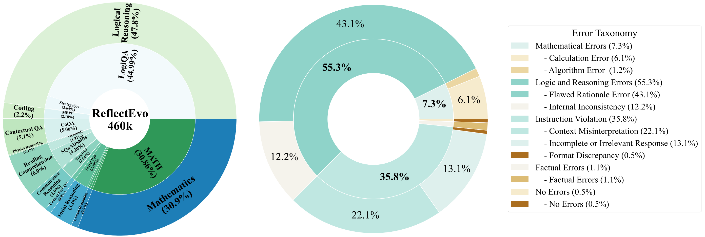
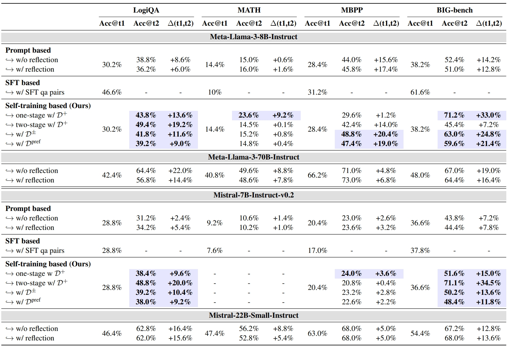

<h1 align="center">ReflectEvo: Improving Meta Introspection of Small LLMs  by Learning Self-Reflection</h1>

  
<p align="center">
    <a href="https://huggingface.co/datasets/bigai-nlco/ReflectionEvo">
        
    </a>
    <a href="https://arxiv.org/abs/2505.16475">
        
    </a>
</p>


**Novel Pipeline for Self-Reflection Generation** : automatic self-reflection generation and curation, which is the first to explore *meta introspection* of SLMs.

**Large-Scale and Diverse Self-generated Reflection Dataset** : a comprehensive reflection training set *ReflectEvo-460K* from 17 source datasets spanning 10 tasks including various reflection instructions and comparative samples.

**Learning Reflection Via Self-training**: four settings of reflection learning through self-reflection and self-correction based on SFT and DPO, which significantly boost the reasoning abilities of SLMs


## 📌Statistics of ReflectEvo-460K





## 📖 Table of contents
- [Installation](#installation)
- [Reflection Generation](#reflection-generation)
- [Reflection Learning through Self-training](#training-guide)
- [Evaluation](#evaluation)
  - [Generate prediction results](#generate-results)
  - [Performance Evaluation](#evaluate-performance)
- [Results](#results)
- [Citation](#citation)

  
## 💁 Installation

   ```bash
   git clone https://github.com/Sheng-Shu/ReflectEvo.git
   cd ReflectEvo
   conda activate reflectevo
   pip install -r requirements.txt
   ```

   
## 🤔 Reflection Generation

You can download the whole set of our **ReflectEvo-460K** here  ([🤗 HF Repo](https://huggingface.co/datasets/bigai-nlco/ReflectionEvo)). The sample data can also be referenced quickly [data/examples](data/examples).

For Reflection Generation, run
```bash
python -m run.run --dataset Logiqa -model_name your_model_path --demand_type reflection_instruction_type
```

The format of the generated sample data can be found in [data/examples/example_Reflection_raw.jsonl](data/examples/example_Reflection_raw.jsonl).

Tasks can be specified via `--dataset` including LogiQA, MATH, MBPP, BIG-bench, and BIG-benchfree (a filtered subset with free-text answers from BIG-bench).

You can also determine the instructions to generate reflections through `--demand_type`.  Types of various instructions from the instruction pool can be seen in Appendix C.1 in the paper for details. You are also encouraged to add your own reflection instruction here.

To convert the generated data into training-ready D<sup>+</sup> formats, the following fields should be extracted and structured as follows:


```js
{
  "id": "",
  "question": "",
  "answer": "",
  "first_trial_reasoning": "", // Use the 'reasoning' field from 'trial 1'
  "first_trial_answer": "", // Use the 'generated_answer' field from 'trial 1'
  "second_trial_reasoning": "", // Use the 'reasoning' field from 'trial 2'
  "second_trial_answer": "", // Use the 'generated_answer' field from 'trial 2'
  "reflections": "", // Use the 'reflections' field from 'trial 2'
  "reason_prompt": [ // Use the 'reasoning_prompt' field from 'trial 1'
    "",
    ""
  ],
  "reflect_prompt": "" // Use the 'reflection_prompt' field from 'trial 2'
}
```

To convert the generated data into training-ready D<sup>±</sup> and D<sup>pref</sup> formats, the following fields should be extracted and structured as follows:

```js
{
  "id": "",
  "question": "",
  "answer": "",
  "first_trial_reasoning": "", // Use the 'reasoning' field from 'trial 1'
  "first_trial_answer": "", // Use the 'generated_answer' field from 'trial 1'
  "second_trial_reasoning_chosen": "", // Use the 'reasoning' field from trial 2 in the preferred sample
  "second_trial_answer_chosen": "", // Use the 'generated_answer' field from trial 2 in the preferred sample
  "reflection_chosen": "", // Use the 'reflections' field from trial 2 in the preferred sample
  "second_trial_reasoning_rejected": "", // Use the 'reasoning' field from trial 2 in the non-preferred sample
  "second_trial_answer_rejected": "", // Use the 'generated_answer' field from trial 2 in the non-preferred sample
  "reflection_rejected": "", // Use the 'reflections' field from trial 2 in the non-preferred output
```

## 🚀 Reflection Learning

For two stage training with D<sup>+</sup>, first train the capability of self-reflection:

```bash
PYTHONPATH=. torchrun --master-port 5508 --nproc_per_node=1 train/train_SFT_two_stage_1.py \
    --task logiqa \
    --num_epochs 3 \
    --resume False \
    --output output_path \
    --model_path your_model_path \
    ---ebs 20 \
    --bs 8 \
    --ss steps \
    --wd 0.01 \
    --lr 1e-3 \
    --gas 4
```

then train the self-correction:
```bash
PYTHONPATH=. torchrun --master-port 5507 --nproc_per_node=1 train/train_SFT_two_stage_2.py  \
    --task logiqa \
    --num_epochs 5 \
    --resume False \
    --output output_path \
    --model_path your_model_path \
    --ss steps \
    --ebs 50  \
    --bs 8 \
    --wd 0.01 \
    --lr 1e-3 \
    --gas 4 \
    --folder training_data_path 
```

For one stage training with D<sup>+</sup>:
```bash
PYTHONPATH=. python train/train_SFT_one_stage.py \
    --task logiqa \
    --input_data training_data_path \
    --output output_path \
    --model_path your_model_path \
```

For Direct Preference Optimization(DPO) training with both D<sup>±</sup> and D<sup>pref</sup>:
```bash
ACCELERATE_LOG_LEVEL=info accelerate launch --config_file configs/deepspeed_zero3.yaml --num_processes=4 run_dpo.py configs/DPO_train_config.yaml
```

## 📊 Evaluation
### Generate prediction results
The prediction during inference includes the first trial reasoning, reflection and the second trial reasoning with corrected answer. 
Generate the predictions for two-stage training on D<sup>+</sup> and DPO training on D<sup>±</sup> and D<sup>pref</sup>:

```bash
python -m run.run --dataset Logiqa --is_test True  --model_name your_model_path --model_config model_config
```
For one-stage training on D<sup>+</sup>:

```bash
python -m run.run_PEFT --dataset Logiqa --is_test True  --model_name your_model_path --model_config model_config
```

`--is_test` is set to "True" for evaluation. `--model_config` is used to specify the two models used for reasoning (Generator) and reflection after reflection learning (Reflector).

### Performance Evaluation

Automatic evaluation on most tasks:

```bash
python -m eval.count "path_to_prediction_results"
```

Automatic evaluation on questions with free-text answers in BIG-bench:

```bash
python -m eval.count_f1 "path_to_prediction_results"
```

## ✅ Results




## 📝 Citation
If you would like to use our data or find our work interesting, please cite:
```bibtex
@article{li2025reflectevo,
  title={ReflectEvo: Improving Meta Introspection of Small LLMs by Learning Self-Reflection},
  author={Li, Jiaqi and Dong, Xinyi and Liu, Yang and Yang, Zhizhuo and Wang, Quansen and Wang, Xiaobo and Zhu, SongChun and Jia, Zixia and Zheng, Zilong},
  journal={arXiv preprint arXiv:2505.16475},
  year={2025}
}
```

