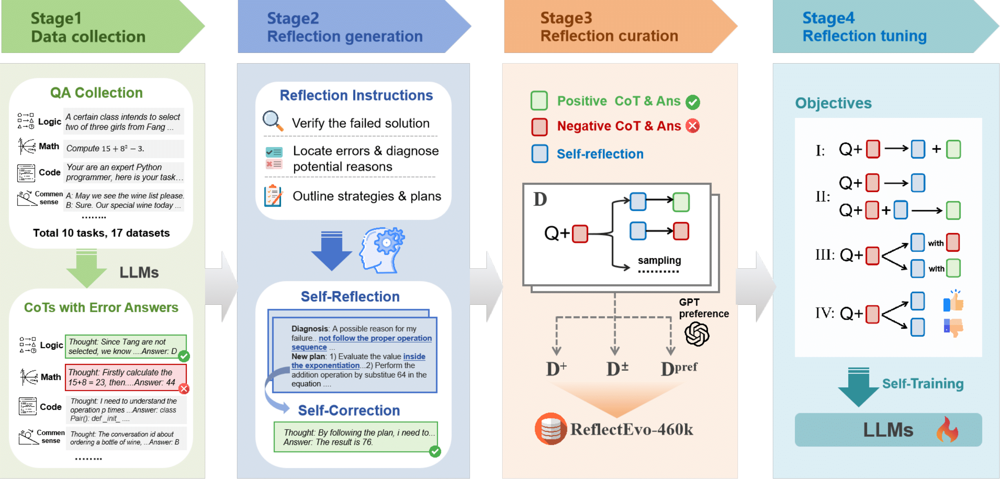

<h2 align="center">Improving Meta Introspection of Small LLMs by Learning Self-Reflection from Self-Generated Data</h2>
<p align="center">

We present a novel pipeline **ReflectEvo** to demonstrate that small language models(SLMs) can enhance meta introspection through reflection learning.



## Installation
1. Clone this repository and navigate to ReflectEvo folder
   
   ```
   git clone https://github.com/Sheng-Shu/ReflectEvo.git
   cd ReflectEvo
   ```
   
2. Install Package
   
   ```
   pip install -r requirements.txt
   ```
   
## Reflection Generation
All Reflection data can be found in 

For Reflection Generation, run
```
python run/run.py --method COT --dataset Logiqa --num_of_data 0 --demand_type 1 --model_name Meta-Llama-3-8B-Instruct
```

## Training

For full-parameter SFT, use
```
```

For parameter-efficient fine-tuning (PEFT), use
```
python train_c2.py --task logiqa --input_data /path/to/training/data --output /path/to/output --model_path /path/to/model
```

For PPO, use
```
```

## Evaluation
For evaluation, use the following command to test the performance of the model
```
python run/run.py --method COT --dataset Logiqa --num_of_data 0 -is_test True  --model_name Meta-Llama-3-8B-Instruct
```
Then use the following command to measure the performance
```
python eval/count.py "your_result_path"
```
